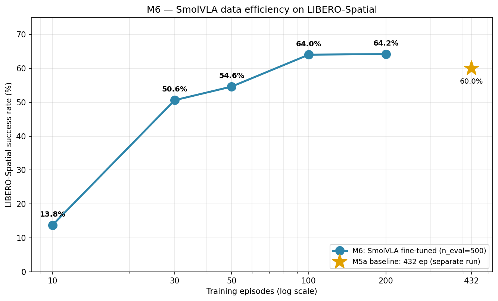

# VLA Portfolio: SmolVLA × LIBERO Reproduction

> 个人 Vision-Language-Action 模型复现项目。基于 Hugging Face SmolVLA-450M，在 LeRobot 框架下完成从环境搭建、模型推理、数据集微调、仿真评估到数据效率与跨范式对比的完整流程。

## 🎯 项目目标

复现并理解 VLA 模型的完整工作流，通过实践掌握：
- VLA 模型的端到端推理与微调
- LeRobot 框架的数据集 / 训练 / 评估管线
- LIBERO 仿真 benchmark 的评估协议
- 数据效率、多任务干扰、跨范式（ACT/DP/VLA）与跨规模对比

## 📊 当前进度

- [x] **M1: 环境搭建** — LeRobot v0.5+ / PyTorch 2.8 + CUDA 12.8 / SmolVLA 依赖
- [x] **M2: SmolVLA Hello World** — 加载预训练模型，端到端推理验证
- [x] **M2.5: Fine-tuning Pipeline Validation** — Smoke test 通过，v0.5 兼容性问题清理
- [x] **M3: SO-101 数据集微调** — 20k 步，loss ~0.55 → **0.086**
- [x] **M4: LIBERO 仿真环境与数据准备** — Mujoco EGL 渲染 + 273K 帧 / 40 tasks 就绪
- [x] **M5: LIBERO 微调与评估** — 单 suite 60.0%；4-suite 混训 avg **50.9%** (n=2000)
- [x] **M6: 数据效率消融** — 10→432 ep 数据效率曲线（饱和点分析）
- [ ] M7: 范式对比 — ACT vs Diffusion Policy vs SmolVLA + 推理速度 bench
- [ ] M8: 规模对比 — π0.5 在 LIBERO 上的评估（官方 checkpoint）

## 🧠 已掌握的核心概念

| 概念 | 关键理解 |
|---|---|
| **VLA 模型** | 从多视角图像 + 本体状态 + 语言指令直接生成连续动作 |
| **SmolVLA 架构** | SmolVLM2 backbone (16 层裁剪) + Flow Matching action expert |
| **Flow Matching** | 替代 Diffusion 的连续动作生成方法，推理快 3-5 倍 |
| **Action Chunking** | 一次预测 N 步动作（默认 50），减少推理频率提高控制率 |
| **Pretraining Transfer** | 起步 loss ≈ 0.55，证实预训练对 SO-100 系列覆盖充分 |
| **Action Space 差异** | SO-101 是 6-DoF joint position，LIBERO 是 7-DoF EEF delta — 物理含义不同，序列微调本质是负迁移 |
| **Multi-task Interference** | 单 suite (Spatial) 60.0% → 4-suite 混训降至 53.8%，共享容量下多任务相互干扰 |
| **Data Efficiency** | LIBERO-Spatial 上 ~50 demo 即达峰值 85%、~100 demo 饱和；<30 demo 性能崩溃 |
| **磁盘满诊断** | ML pipeline 中磁盘满会伪装成各种网络错误，第一反应应是 `df -h` |

## 🛠 技术栈

- **VLA 模型**: SmolVLA-450M ([lerobot/smolvla_base](https://huggingface.co/lerobot/smolvla_base))
- **框架**: LeRobot (main branch, ≥ 0.5.2)
- **仿真**: Mujoco 3.8 + LIBERO + robosuite (EGL headless rendering)
- **GPU**: NVIDIA RTX 4090 (24GB)
- **环境**: AutoDL 云服务器，PyTorch 2.8.0 + CUDA 12.8 + Python 3.12

## 📁 仓库结构

    .
    ├── scripts/
    │   ├── 01-05    # M2-M3: inference + SO-101 training
    │   ├── 06       # M4: LIBERO env validation
    │   ├── 07a-08   # M5a: Spatial training + eval
    │   ├── 09-10    # M5a: visualization + summary
    │   ├── 11-12    # M5b: 4-suite pipeline + A/B/C smoke
    │   ├── 13       # M5b: visualization
    │   └── 14-15    # M6: data-efficiency pipeline + plot
    ├── results/     # loss curves, summaries, CSV
    ├── notes/       # installation, 17 pitfalls, M3/M5a/M5b/M6 reflections
    └── README.md

## 📈 实验结果

### M3: SO-101 Full Fine-tuning

| 指标 | 值 |
|---|---|
| 训练步数 | **20,000** |
| Dataset | SO-101 PickPlace (50 ep, 11,939 frames) |
| Initial / **Final loss** | ~0.55 / **0.086** |
| 总耗时 | **1h 11min** (RTX 4090) |

### M5: LIBERO Fine-tuning & Evaluation

**M5a — 单 suite (LIBERO-Spatial)**: 432 ep @ 20k steps → **60.0%** (n=500)

**M5b — 4-suite 混训** (n=500/suite, 2000 total):

| Suite | Spatial | Object | Goal | Long | **Avg** |
|---|---|---|---|---|---|
| Success | 53.8% | 50.6% | 66.0% | 33.0% | **50.9%** |

> **关键发现 — 多任务干扰**：4-suite 混训把 Spatial 从单 suite 的 60.0% 拉低到 53.8%，说明固定容量下多任务相互竞争；Long（长程任务）最难，仅 33.0%。

### M6: Data Efficiency (LIBERO-Spatial, n=500/variant)

| Episodes | 10 | 30 | 50 | 100 | 200 | 432* |
|---|---|---|---|---|---|---|
| Success | 13.8% | 50.6% | 54.6% | 64.0% | 64.2% | 60.0% |

*432 = M5a 全量基线（独立 run）。

> **结论**：SmolVLA 在 LIBERO-Spatial 上 ~50 个 demo 即达峰值的 ~85%、~100 个基本饱和（~64%）；低于 ~30 个 demo 性能崩溃。预训练 backbone 让微调高度数据高效。
>
> **已知局限**：M6 采用顺序采样（非分层），episode 数同时耦合了「每任务 demo 量」与「任务覆盖度」，因此曲线不能纯作 per-task 数据效率读；分层重采样可解耦（详见 notes/06）。

## 📚 参考资料

- [SmolVLA Paper (arXiv:2506.01844)](https://arxiv.org/abs/2506.01844)
- [LeRobot GitHub](https://github.com/huggingface/lerobot)
- [LIBERO Benchmark](https://libero-project.github.io/)

## 👤 About the Author

**Background**: B.S. & M.S. at Southern University of Science and Technology (SUSTech)
- **B.S.**: Robotics Engineering
- **M.S.**: Intelligent Manufacturing and Robotics

**Research interests**: modern robot control theory · hybrid force-position / impedance control · 6-DoF force sensor parameter identification and external force estimation · hand-eye calibration · multi-modal visual perception · 6-DoF visual grasping · machine learning / deep learning modeling and optimization · LLM engineering · end-to-end robot system deployment

## 📮 Contact

- **Email**: 1820191867@qq.com
- **GitHub**: [@BugLoverNaN](https://github.com/BugLoverNaN)

## 📝 License

MIT
