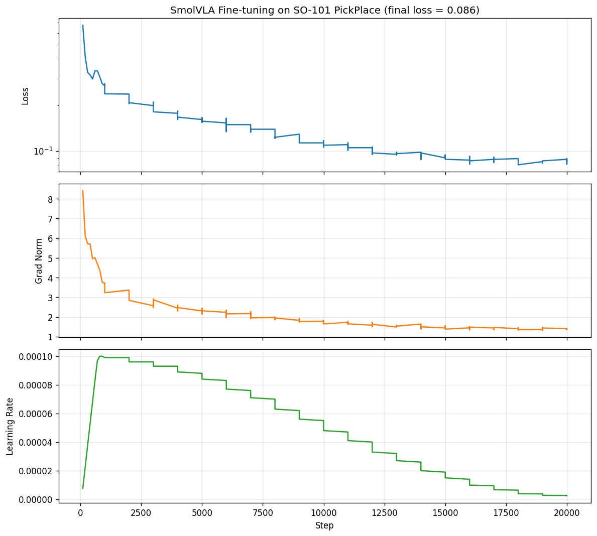
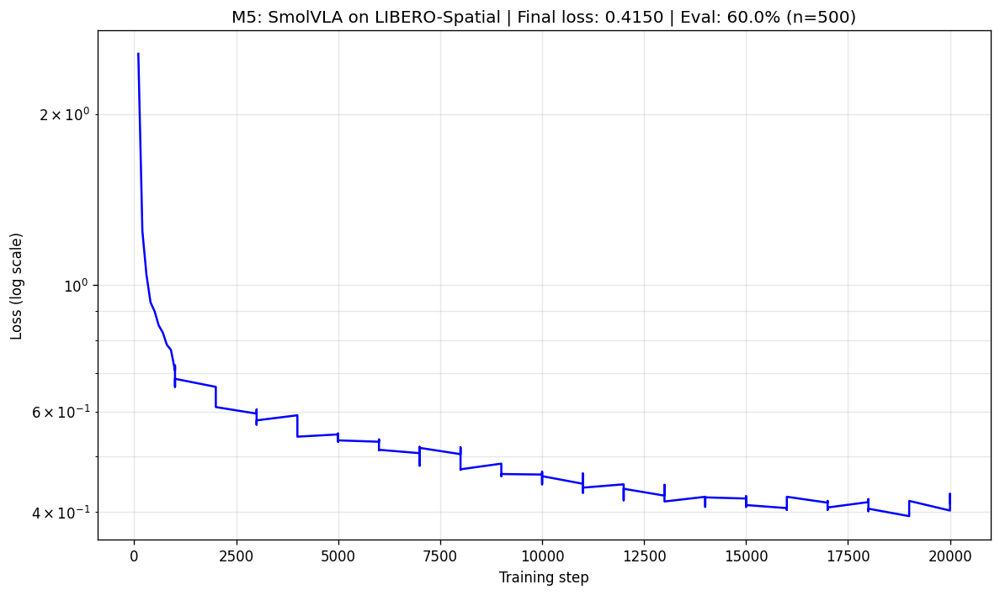
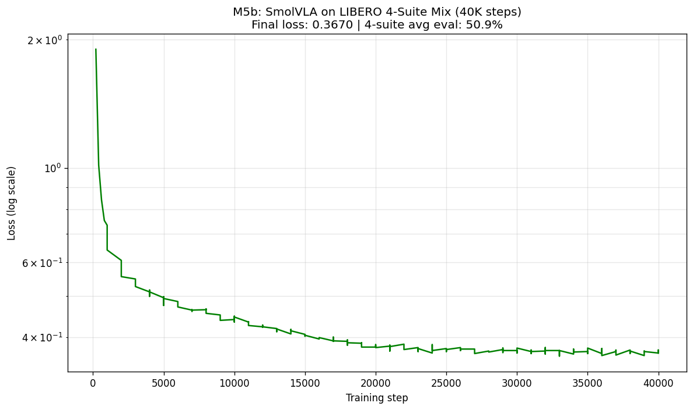

# VLA Portfolio: SmolVLA × LIBERO 系统性复现

> 个人 Vision-Language-Action 模型复现项目。基于 Hugging Face SmolVLA-450M，在 LeRobot 框架下完成真机数据微调、仿真 benchmark 评估、单任务 vs 多任务训练对比的完整工程链路，并揭示多任务干扰现象。

## 🎯 项目目标

复现并深入理解 SmolVLA 这一轻量级 VLA 模型的完整工作流，掌握：
- VLA 模型端到端推理、微调、评估
- LeRobot 框架的数据 / 训练 / 评估管线
- LIBERO 仿真 benchmark 评估协议
- 跨本体迁移与多任务干扰的工程洞察
- 训练吞吐优化与全自动 pipeline 工程

## 📊 当前进度

- [x] **M1: 环境搭建** — LeRobot v0.5+ / PyTorch 2.8 + CUDA 12.8
- [x] **M2: SmolVLA Hello World** — 加载预训练模型推理
- [x] **M2.5: Pipeline Validation** — Smoke test 通过
- [x] **M3: SO-101 真机微调** — 20K 步，loss 0.55 → 0.086
- [x] **M4: LIBERO 环境与数据** — Mujoco EGL + 273K 帧
- [x] **M5a: LIBERO-Spatial 专项训练** — 20K 步，60.0% (n=500)
- [x] **M5b: LIBERO 4-suite 混合训练** — 40K 步，avg 50.9% (n=2000)
- [ ] **M6: 数据效率消融实验** (进行中) — 量化 VLA 数据需求曲线
- [ ] M7: ACT / Diffusion Policy / SmolVLA 三范式对比 (计划中)

## 🏆 关键实验结果

### M3: SmolVLA on SO-101 PickPlace (真机数据)

| 指标 | 值 |
|---|---|
| 训练步数 | 20,000 |
| Final loss | **0.086** |
| 训练时长 | 1h 11min |

### M5a: LIBERO-Spatial 专项 (单 suite, 20K 步)

| 指标 | 值 |
|---|---|
| Final loss | 0.42 |
| **Eval success (n=500)** | **60.0%** |

### M5b: LIBERO 4-Suite 混合 (40K 步)

| Suite | Success (n=500) | Paper (450M) |
|---|---|---|
| LIBERO-Spatial | 53.8% | 95.4% |
| LIBERO-Object | 50.6% | 96.6% |
| LIBERO-Goal | **66.0%** | 93.4% |
| LIBERO-Long | 33.0% | 80.0% |
| **Average** | **50.9%** | 91.4% |

训练: Final loss 0.367, 5h 41min, batch=16, num_workers=8

### 🔑 核心发现 1: 多任务干扰 (Multi-Task Interference)

| 策略 | LIBERO-Spatial | 训练 |
|---|---|---|
| A (单 suite 专训) | **60.0%** | Spatial only, 20K |
| B (4 suite 混训) | 53.8% | All 4 suites, 40K |

尽管混合训练用了 2 倍步数 + 4 倍数据，Spatial 反而低 6.2pp。模型容量在 4 个任务分布间被稀释，单 suite 专精度下降——揭示 generalist vs specialist 的容量权衡。

### 🔑 核心发现 2: 跨本体迁移差距

M3 (SO-101) 起步 loss 0.55 vs M5 (Franka) 起步 1.83，**3.3 倍差距**。SmolVLA-base 在 SO-100 系列 (6-DoF joint) 上预训练充分，迁移到 Franka (7-DoF EEF delta) 需大量 action-head 重学习。

### 🔑 工程优化: 训练吞吐 +67%

诊断 GPU 利用率仅 50%，分析 data_s > updt_s 定位 CPU 瓶颈。通过 num_workers A/B/C 测试 (4→6→8)，吞吐从 1.0 提升到 1.67 step/s，40K 步训练压缩至 5.7 小时。

## 🧠 核心概念

| 概念 | 关键理解 |
|---|---|
| **VLA 模型** | 从多视角图像 + state + 语言指令直接生成连续动作 |
| **SmolVLA 架构** | SmolVLM2 (16 层裁剪) + Flow Matching action expert |
| **Flow Matching** | 替代 Diffusion，推理快 3-5 倍 (10 步 vs 50-1000 步) |
| **Action Chunking** | 一次预测 50 步，降推理频率提控制率 |
| **Pretraining Transfer** | M3 起步 0.55 vs M5 1.83，量化跨本体差距 |
| **多任务干扰** | 单 suite 60% vs 4 suite 混训 53.8%，generalist 稀释 specialist |
| **训练吞吐优化** | data_s > updt_s 即 CPU-bound，加 num_workers |
| **Train vs Eval 优化哲学** | 训练优化吞吐，评估保持可复现性 |
| **统计方差** | Smoke n=30 (50%) vs Full n=500 (60%)，n 必须 >=50 |

## 🛠 技术栈

- **VLA 模型**: SmolVLA-450M
- **框架**: LeRobot main branch (v0.5+)
- **仿真**: Mujoco 3.8 + LIBERO + robosuite (EGL headless)
- **GPU**: NVIDIA RTX 4090 D (24GB), 192-core Xeon host
- **环境**: AutoDL，PyTorch 2.8.0 + CUDA 12.8 + Python 3.12

## 📁 仓库结构

    .
    ├── scripts/
    │   ├── 01-05    # M2-M3: inference + SO-101 training
    │   ├── 06       # M4: LIBERO env validation
    │   ├── 07a-08   # M5a: Spatial training + eval
    │   ├── 09-10    # M5a: visualization + summary
    │   ├── 11-12    # M5b: 4-suite pipeline + A/B/C smoke
    │   └── 13       # M5b: visualization
    ├── results/     # loss curves, summaries, CSV
    ├── notes/       # installation, 17 pitfalls, M3/M5a/M5b reflections
    └── README.md

## 📈 详细结果

- M3: [results/03_m3_training_summary.md](results/03_m3_training_summary.md)
- M5a: [results/05_m5_training_summary.md](results/05_m5_training_summary.md)
- M5b: [results/06_m5b_training_summary.md](results/06_m5b_training_summary.md)
- 工程反思: notes/04 (M3), notes/05 (M5a), notes/06 (M5b)
- 17 个工程踩坑: [notes/03_finetuning_setup.md](notes/03_finetuning_setup.md)

## 🗺 后续计划 (Roadmap)

- **M6 数据效率消融**: 用 10/30/50/100/200/500 episodes 训练，量化 SmolVLA 在 LIBERO-Spatial 上的数据需求拐点
- **M7 三范式对比**: ACT (Transformer) vs Diffusion Policy (UNet) vs SmolVLA (VLM)，对比成功率 + 推理延迟 + 显存
- **M8 (探索)**: π0 / OpenVLA 等更大模型的评估对比

## 📚 参考

- [SmolVLA Paper](https://arxiv.org/abs/2506.01844)
- [LeRobot GitHub](https://github.com/huggingface/lerobot)
- [LIBERO Benchmark](https://libero-project.github.io/)

## 👤 About the Author

**Background**: B.S. & M.S. at Southern University of Science and Technology (SUSTech)
- **B.S.**: Robotics Engineering
- **M.S.**: Intelligent Manufacturing and Robotics

**Research interests**: modern robot control theory · hybrid force-position / impedance control · 6-DoF force sensor parameter identification and external force estimation · hand-eye calibration · multi-modal visual perception · 6-DoF visual grasping · machine learning / deep learning modeling and optimization · LLM engineering · end-to-end robot system deployment

## 📮 Contact

- **Email**: 1820191867@qq.com
- **GitHub**: [@BugLoverNaN](https://github.com/BugLoverNaN)

## 📝 License

MIT
